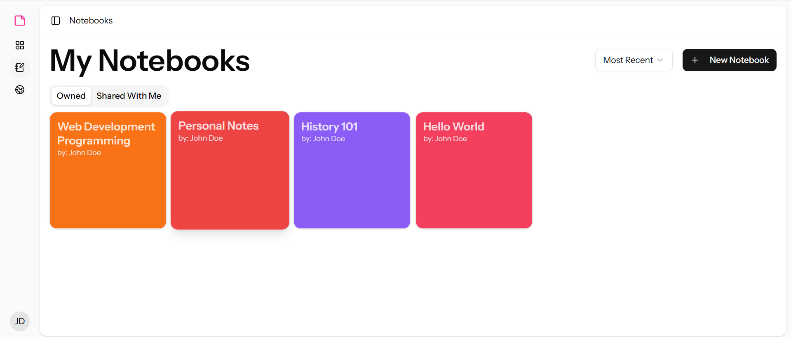
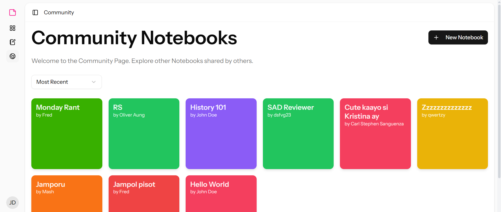
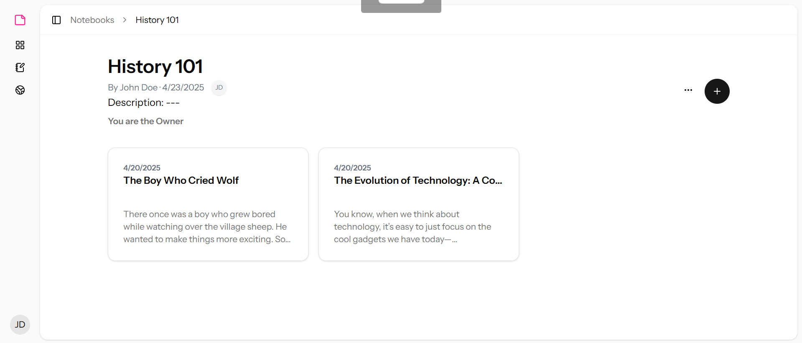
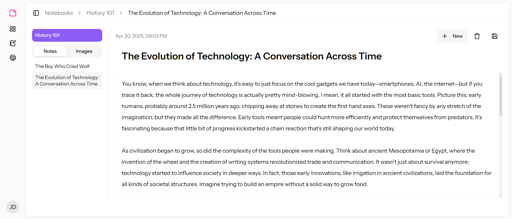
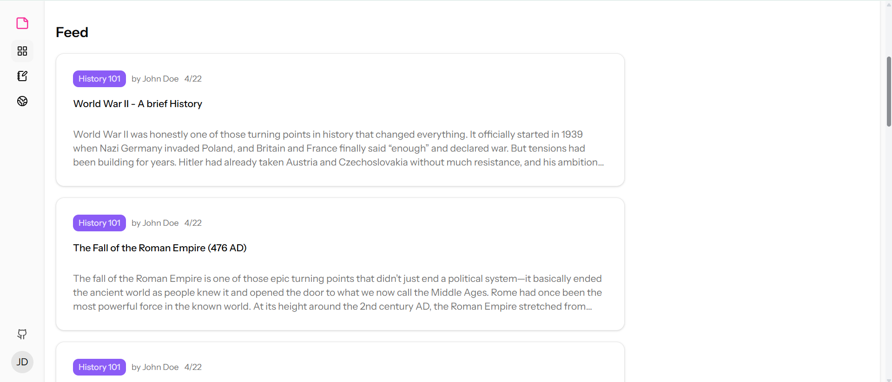
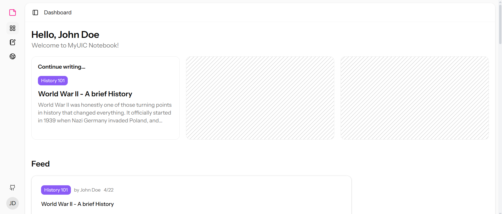
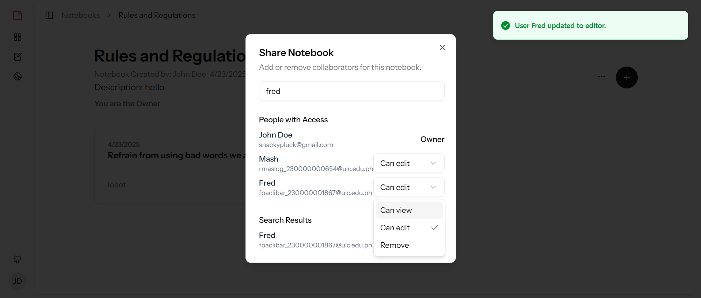

# MyUIC Notebook

[**Live App**](https://myuicnotebook-master-osuioq.laravel.cloud/dashboard)  
[**GitHub Repository**](https://github.com/JohnEstano/MyUICNotebook.git)

---

##  About

MyUIC Notebook is a web-based application that allows users to create, organize, and share notebooks and notes with ease. Whether you're a student or a professional, MyUIC Notebook provides a clean and efficient interface for managing your personal or academic notebooks.

---

##  Features

- **Create and Organize Notebooks**: Easily create notebooks for different topics, and organize your notes within them.
- **Share Notebooks**: Share your notebooks with others, whether they're public or private.
- **Note Editor**: A powerful note editor with support for text formatting and image uploads.
- **Responsive Design**: Works across multiple devices, including desktop, tablet, and mobile.
- **User Authentication**: Sign up, log in, and manage your profile with secure authentication.
- **Community Page**: Browse public notebooks shared by others in the community.
- **Note Attachments**: Attach images and other files to your notes.

---

##  Screenshots










---

## Tech Stack

- **Frontend**: React, ShadCN UI, Tailwind CSS
- **Backend**: Laravel 12
- **Authentication**: Inertia.js
- **Database**: MySQL
- **Deployment**: Laravel Cloud

---

## Installation

To get started with MyUIC Notebook locally:

### Prerequisites

- [Node.js](https://nodejs.org/) (v14 or higher)
- [Composer](https://getcomposer.org/)
- [MySQL](https://www.mysql.com/)

### Steps

```bash
# Clone the repository
git clone https://github.com/JohnEstano/MyUICNotebook.git

# Go into the project directory
cd MyUICNotebook
